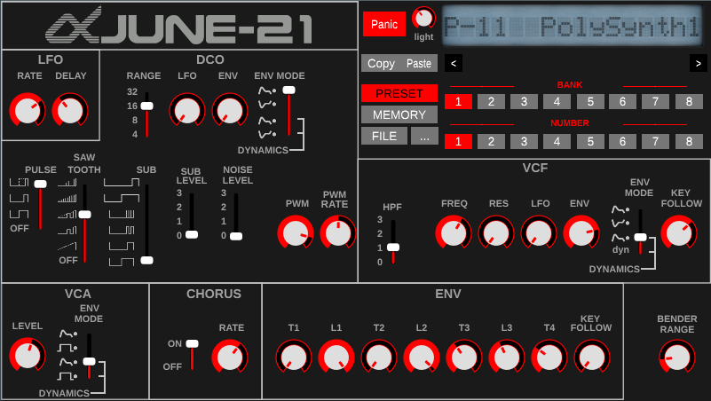

# june-21
Roland Roland Juno-1 / Juno-2 / MKS-50 emulator using [CSound](https://csound.com) &amp; [Cabbage](https://www.cabbageaudio.com/)

## Status 
June-21 can read Juno 1 / 2 MKS-50 presets. The emulator includes Juno 2 factorypresets. you can find many presets here : http://www.llamamusic.com/mks50/mks-50_patches.html, you can read real .syx file june-21 !

It's still a work in progress, so not all presets will work as in the real gear, some presets might not be working. 

## requirement 
Linux - CSound must be present in the system 
Windows - a CSound runtime is in the distrib file

