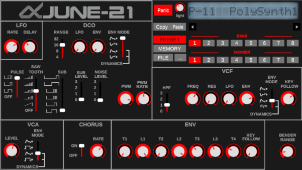

## About
June-21 is an open source [VST plugin](https://en.wikipedia.org/wiki/Virtual_Studio_Technology) emulation of the [Roland Alpha Juno syntheziser series](https://en.wikipedia.org/wiki/Roland_Alpha_Juno).

## Sound Demos
(sorry for the tempo :-/) 
<iframe width="100%" height="75" scrolling="no" frameborder="no" allow="autoplay" src="https://w.soundcloud.com/player/?url=https%3A//api.soundcloud.com/tracks/736262815&color=%23ff5500&auto_play=false&hide_related=false&show_comments=true&show_user=true&show_reposts=false&show_teaser=true&visual=true"></iframe>

<iframe width="100%" height="75" scrolling="no" frameborder="no" allow="autoplay" src="https://w.soundcloud.com/player/?url=https%3A//api.soundcloud.com/tracks/736262812&color=%23ff5500&auto_play=false&hide_related=false&show_comments=true&show_user=true&show_reposts=false&show_teaser=true&visual=true"></iframe>

<iframe width="100%" height="75" scrolling="no" frameborder="no" allow="autoplay" src="https://w.soundcloud.com/player/?url=https%3A//api.soundcloud.com/tracks/736262806&color=%23ff5500&auto_play=false&hide_related=false&show_comments=true&show_user=true&show_reposts=false&show_teaser=true&visual=true"></iframe>

<iframe width="100%" height="75" scrolling="no" frameborder="no" allow="autoplay" src="https://w.soundcloud.com/player/?url=https%3A//api.soundcloud.com/tracks/736262800&color=%23ff5500&auto_play=false&hide_related=false&show_comments=true&show_user=true&show_reposts=false&show_teaser=true&visual=true"></iframe>

<iframe width="100%" height="75" scrolling="no" frameborder="no" allow="autoplay" src="https://w.soundcloud.com/player/?url=https%3A//api.soundcloud.com/tracks/736262803&color=%23ff5500&auto_play=false&hide_related=false&show_comments=true&show_user=true&show_reposts=false&show_teaser=true&visual=true"></iframe>

## Status 
June-21 can read and play Juno 1 / 2 MKS-50 presets. The emulator includes Juno 2 factory tones : "Preset" and "Memory". 

You can also find many presets [here](http://www.llamamusic.com/mks50/mks-50_patches.html), you can test them with June-21 !

It's still a work in progress, so not all presets will work as in the real gear, some presets might not be working.

The text and schematics are partly inspired by the original Juno-2 documentation.

The look of the GUI is obviously inspired by the Roland PG-300.

** Nota Bene:** June-21 is still in development and is not a perfect emulator, so some tones can be far from the real thing and some won't work (but some can be very accurate and pleasing!). As of now (Dec 2019) some things are not implemented :

* **Bender** : bender done but no modulation yet
* **Portamento, chord memory, octave transpose** : not done yet
* **Aftertouch** : won't be done (at least by me) as my own Juno-2's aftertouch is not working.
You can also look at the [current issues](https://github.com/mikerodd/june-21/issues)

## Requirements
Linux - CSound must be present in the system 
Windows - a CSound runtime is in the distrib file

